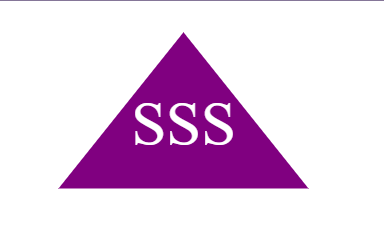
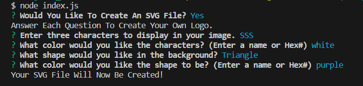

# SVG Creator 

 ## Description

 This program creates an SVG with limited choices to make a quick logo.

 

 ## Installation

 Clone this repo to use the program.

 ## Usage

 Run 'node index.js' in your terminal to start the SVG Creator.

 

 

  ## License

  MIT License

  Permission is hereby granted, free of charge, to any person obtaining a 
  copy of this software and associated documentation files (the "Software"), to 
  deal in the Software without restriction, including without limitation the 
  rights to use, copy, modify, merge, publish, distribute, sublicense, and/or 
  sell copies of the Software, and to permit persons to whom the Software is
  furnished to do so, subject to the following conditions:

  The above copyright notice and this permission notice shall be included in all
  copies or substantial portions of the Software.

  THE SOFTWARE IS PROVIDED "AS IS", WITHOUT WARRANTY OF ANY KIND, EXPRESS OR
  IMPLIED, INCLUDING BUT NOT LIMITED TO THE WARRANTIES OF MERCHANTABILITY,
  FITNESS FOR A PARTICULAR PURPOSE AND NONINFRINGEMENT. IN NO EVENT SHALL THE
  AUTHORS OR COPYRIGHT HOLDERS BE LIABLE FOR ANY CLAIM, DAMAGES OR OTHER
  LIABILITY, WHETHER IN AN ACTION OF CONTRACT, TORT OR OTHERWISE, ARISING FROM,
  OUT OF OR IN CONNECTION WITH THE SOFTWARE OR THE USE OR OTHER DEALINGS IN THE
  SOFTWARE.

 ## Questions

 My GitHub: [GitHub](https://github.com/samanthagard13)
 
 My Email: [Email](samantha.gard13@gmail.com)